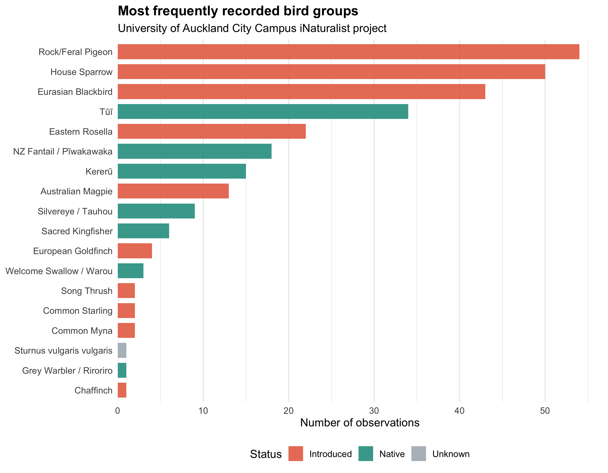
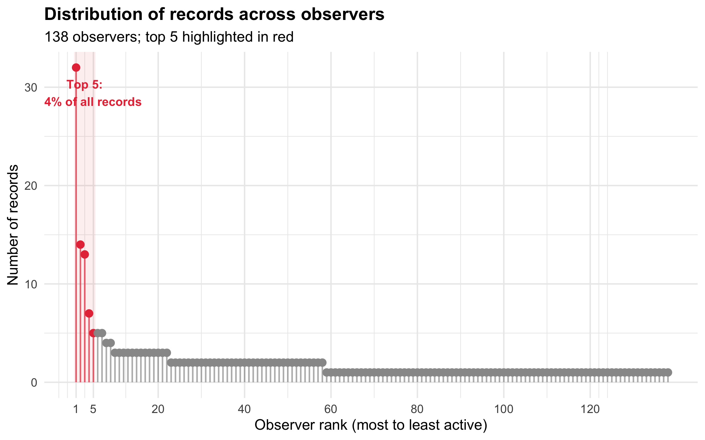
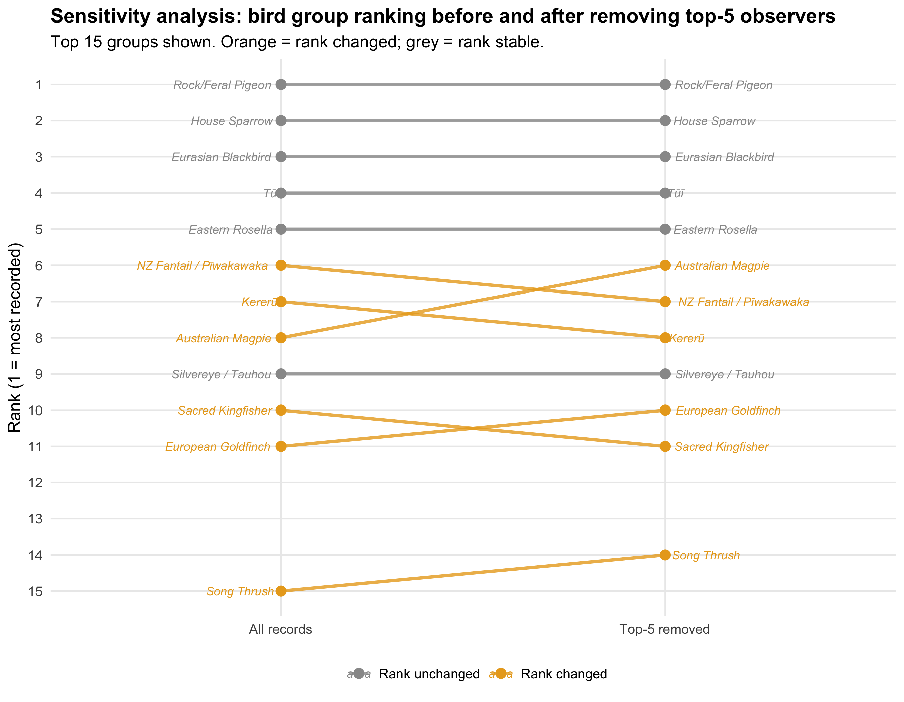

```{r setup, include=FALSE}
knitr::opts_chunk$set(echo = FALSE, warning = FALSE, message = FALSE,
                      fig.align = "center")
```

---

Imagine opening a restaurant review app and finding a neat ranking of the most popular dishes in town. The list looks useful at first. A few familiar favourites sit at the top, while rarer dishes appear further down.

Then you notice something odd. Five reviewers wrote a quarter of all the reviews.

The ranking is not useless. Those dishes may really be popular. But before trusting the list, you would want to know something about the people behind it: who reviewed the food, how often they wrote, and whether the ranking would change if the most active reviewers were removed.

The bird records from the University of Auckland City Campus raise a similar question. On iNaturalist, 138 observers recorded 280 bird observations across 29 bird groups. But those records were not evenly shared. The five most active observers contributed 71 records, or 25.4% of the dataset.

So the campus bird list is doing two things at once. It tells us which birds were recorded, and it tells us something about who was looking. It records encounters between birds and observers, not birds alone.

---

## A decade of looking

Since February 2016, volunteers have been uploading research-grade bird observations to the iNaturalist project *Biota of University of Auckland City Campus*. By April 2026, the project had accumulated 280 bird records from 138 individual observers, covering 29 bird groups across a decade of opportunistic encounters.

Each record is a small moment of attention. Someone walks to a lecture, pauses near a fountain, sits on a bench, or crosses a patch of trees. A bird appears. The person notices it, photographs it, identifies it, and decides to upload the record.

That word, *notices*, matters. iNaturalist does not send people out on fixed routes with clipboards and timed surveys. It collects what people happen to see, when they happen to be looking. The dataset therefore reflects two living patterns at once: the birds that use the campus, and the people who move through it.

Understanding the space between those two patterns is the purpose of this analysis.

---

## A leaderboard for birds

The first view of the data looks like a bird leaderboard.

```{r figure-ranking, fig.cap="**Figure 1.** Most frequently recorded bird groups on the UoA city campus, 2016–2026. Teal bars = native NZ species; salmon bars = introduced species. Tūī, a native honeyeater, appears almost as frequently as House Sparrow, even though the two species are unlikely to be equally abundant on a busy urban campus.", out.width="92%"}

```

Rock/Feral Pigeon sits at the top, followed by House Sparrow and Eurasian Blackbird. So far, this feels unsurprising. These are familiar urban birds, comfortable around buildings, footpaths, lawns, and people.

The more interesting name is tūī (*Prosthemadera novaeseelandiae*). Tūī is a native New Zealand honeyeater, recognisable by its white throat tufts and rich, varied calls. In this dataset, it appears fourth on the list, with a record count close to House Sparrow.

That should make us pause. Anyone who has spent time on an urban campus knows that House Sparrows are everywhere: under café tables, near benches, around bins, and in the small gaps between buildings. Tūī are present too, especially near flowering trees, but they do not feel equally numerous.

So why does the leaderboard bring them so close together?

One answer is attention. Tūī are large, vocal, native, and distinctive. When one appears, people notice. A House Sparrow is so familiar that it can fade into the background. This does not make the tūī records wrong. It means the ranking reflects more than bird abundance. It also reflects what people find worth recording.

This is more than a small observer-bias example. It shows a direction to the bias. In iNaturalist data, the species that rise in the ranking are not always the most numerous. They may be the most noticeable, the most charismatic, or the most likely to make someone stop walking and open their camera.

Like a restaurant ranking, the list tells us what appeared most often in the records. Before treating it as a measure of what is most common, we need to ask who made the records.

---

## Who writes the reviews?

This brings us to the question behind any crowd-sourced dataset: who exactly is in the crowd?

```{r figure-observers, fig.cap="**Figure 2.** Distribution of records across 138 observers, ranked from most to least active. Each point represents one observer; height shows their total number of records. The red shaded region highlights the top five contributors, who together account for 25.4% of all records.", out.width="87%"}

```

The pattern is stark. Among 138 contributors, the five most active observers submitted 71 records between them, just over a quarter of the entire dataset. The remaining 133 contributors shared the other three-quarters, with most submitting only one or two records each. This kind of heavily skewed distribution is typical of citizen science platforms: a small core of dedicated enthusiasts generates a disproportionate share of the data, while casual observers drift in and out.

There is nothing wrong with enthusiastic contributors. Their records are real, their identifications are verified, and their consistency over time is exactly what makes long-running datasets valuable. But enthusiasm can also introduce bias. An observer who walks the same route past Albert Park every week, specialising in native birds, will produce a very different record than an observer who photographs whatever crosses their path on the way to a lecture. If the most active observers have systematically different interests or routes, the leaderboard they collectively built may reflect their preferences as much as the campus's actual bird community.

This is the restaurant problem made concrete: do those five top reviewers change the ranking?

---

## Removing the regulars

The most direct test was also the simplest. I removed every record submitted by the five most active observers, rebuilt the bird leaderboard from the remaining 133 contributors, and compared the two rankings.

```{r figure-sensitivity, fig.cap="**Figure 3.** Sensitivity analysis: bird group ranking with all records (left) versus after removing the five most active observers (right). Lines connect the same group across both rankings. Orange lines indicate groups that changed rank; grey lines held their position.", out.width="92%"}

```

The top of the list held firm. Rock/Feral Pigeon, House Sparrow, Eurasian Blackbird, Tūī, and Eastern Rosella remained in exactly the same order whether the top contributors were included or excluded. Removing the regular reviewers did not overturn the leaderboard. The familiar birds were still familiar.

Lower down the ranking, however, the list became less steady. Nine groups changed position after the top five observers were removed. Australian Magpie moved up two places, while NZ Fantail and Kererū each moved down one. Several less-common species shuffled around in the lower half of the list.

That pattern makes sense, but not because the birds themselves changed. It is a property of small numbers. Near the bottom of the leaderboard, many groups are separated by only one or two records, so removing a handful of observations can change the order.

Australian Magpie moved up after the five most active observers were removed, probably because the groups around it lost proportionally more records from those observers. NZ Fantail and Kererū moved down, suggesting that their rankings were more dependent on records from highly active contributors. The movements are small, but they are useful. They show where the leaderboard is thinnest: not at the top, where many people recorded the same familiar birds, but near the bottom, where one active observer can still shift the story.

Common birds accumulate records from many independent observers, so no single contributor can easily dominate their count. Less frequently recorded species sit on a thinner evidence base. Their apparent ranking is therefore more sensitive to who was doing the recording.

---

## Counting birds, or counting attention?

The sensitivity analysis tells us that the top of the bird leaderboard is fairly stable. But it raises a second question that the ranking alone cannot answer. On days when observers recorded seven bird groups rather than one, was that because more birds were present, or because more people were looking?

This distinction matters. If daily species richness mostly follows observer effort, then apparent patterns over months or years could be shaped by the human calendar rather than by bird ecology. A busy month on iNaturalist might mean a busy month for birds, but it might also mean a busy month for people with phones.

To separate these possibilities, I modelled daily bird-group richness as a count outcome. The predictors represented four possible explanations: how many observers were active that day, which season it was, whether it was a weekday or weekend, and which year the record came from. Because the response was a count, a Poisson model was a sensible starting point. A negative binomial version told the same broad story, so I kept the simpler model.

The result was plain. Days with more active observers recorded more bird groups. Season, weekend status and year were much less informative once observer effort was included.

In practical terms, the model suggested that moving from a single-observer day to a day with several active observers could roughly double the expected number of bird groups recorded. This does not mean that the campus bird community truly doubled. It means that more people looking produced a richer list.

It is like searching a park for dropped coins. If one person searches for half an hour, they may find a few. If five people search the same park for the same amount of time, the pile of coins is likely to be larger. The ground did not produce more coins. More searchers simply found more of what was already there.

Bird records work in much the same way. More observers increase the chance that ordinary species are recorded, that less obvious species are noticed, and that short-lived encounters make it into the dataset.

I also asked whether it mattered *who* was looking, not just how many people were looking. A mixed-effects model included observer identity as an additional source of variation. If particular observers had strong individual habits, such as repeatedly visiting certain places or recording certain types of birds, this model could have picked up some of that extra observer-level structure.

It did not add much. Once total observer effort was included, observer identity contributed little to the model. This should not be read as proof that individual behaviour never matters. Some observers may still prefer certain routes, times or species. But in this dataset, the total amount of looking was more informative than the identity of the person looking.

March offers a useful example. In the raw monthly totals, March looked like the busiest recording month. It is also the start of the academic semester, when more students are on campus and course-related activities may prompt iNaturalist uploads. After accounting for observer numbers, the March peak looked much less like a strong ecological signal and much more like a human calendar effect.

With a larger dataset, this would be a good place to test seasonal ecology more directly. One could compare effort-corrected richness across months, or model particular species whose flowering, breeding, or movement patterns are expected to vary through the year. In this dataset, however, there were only 136 observation days. That is not enough to cleanly separate a subtle seasonal signal from the much stronger signal of observer effort.

The main message is simple: more eyes produced more species records.

---

## Not a census, but not useless

All this attention to observer effort should not make the bird records feel less valuable. The list is not a perfect census, but it still contains real ecological information.

Tūī and kererū (New Zealand wood pigeon, *Hemiphaga novaeseelandiae*) are good examples. Both are native birds closely associated with trees, flowers, fruit, and patches of connected urban vegetation. Their regular appearance in records from an inner-city campus is not trivial. It suggests that the campus is not just concrete, lecture theatres, and traffic. It is also part of a wider urban habitat network.

Albert Park, immediately east of the campus, is likely to matter here. Its mature trees and planted spaces provide feeding and movement opportunities for birds that would otherwise seem out of place in the middle of the city. Tūī can use flowering trees for nectar. Kererū can use fruiting trees. Smaller native birds such as NZ Fantail, or pīwakawaka, and Silvereye, or tauhou, can move through gardens, edges, and remnant vegetation.

At the same time, the native species in the dataset should not be read as a direct measure of abundance. In the bird records, introduced species made up about 69% of observations and native species about 31%. Even that native share may be higher than the true balance of birds on campus. A person is more likely to photograph a tūī than a sparrow, and more likely to upload a Sacred Kingfisher than another feral pigeon. The selection effect points toward the unusual, the charismatic, and the species that feel worth stopping for.

That does not make the native records decorative or accidental. They are genuinely present. The important point is narrower: iNaturalist is better at showing which birds people encounter and choose to record than at measuring the true abundance of every bird on campus.

---

## Reading citizen science carefully

Back to the restaurant. The leaderboard holds up for the popular items. Remove the most active reviewers, and the rankings at the top barely shift. For the less-reviewed dishes near the bottom of the menu, one enthusiastic regular can still make a visible difference.

There is also a simpler lesson. A restaurant receives more reviews on days when more customers walk in. That does not necessarily mean the food was better on those days. It means more people were there to notice, order, judge, and write.

The iNaturalist campus bird record works in a similar way. The data are not wrong, and the patterns they reveal are real. But they record encounters between birds and people, not birds alone. Some species are genuinely common on campus. Some native birds are genuinely using the urban habitat. At the same time, the number of bird groups recorded on a given day depends strongly on how many people were paying attention.

That is not a reason to distrust citizen science data. It is the foundation for reading it well. Control for observer effort when comparing across time. Treat rare-species rankings with caution. Remember that absence of records is not absence of birds. A campus with no iNaturalist uploads on a given day has not lost its tūī. It has only lost its observers.

The birds are there. The data begin when someone notices.

---

**About the data and analysis**

Observation data were exported from the iNaturalist project *Biota of University of Auckland City Campus* on 27 April 2026, filtered to research-grade Aves records. Species and subspecies were grouped into broader bird groups for clarity. Statistical analysis was conducted in R: a Poisson GLM and Poisson GLMM (lme4) were fitted with log-transformed observer count, season, day type, and year as predictors of daily species richness; model selection used AIC and dispersion diagnostics (DHARMa). A sensitivity analysis tested ranking stability after removing the five most active observers by total record count. Full annotated code is available at: [https://github.com/mengyuanzheng9-star/uoa-campus-biota](https://github.com/mengyuanzheng9-star/uoa-campus-biota)

**Ethical considerations**

All observations used in this analysis are publicly available through iNaturalist under Creative Commons licences. Even so, public data still require care. Observer usernames were used only as anonymous identifiers for the sensitivity analysis and mixed-effects model grouping. No attempt was made to identify, profile, rank, or make claims about individual contributors.

The analysis also avoids reporting exact observer routes or precise locations for less commonly recorded species. Results are presented at the level of campus-wide patterns rather than individual people or sensitive locations. Throughout the article, I describe the data as recorded observations rather than true abundance or confirmed absence, because opportunistic citizen science records cannot support those stronger claims on their own.

*AI use statement: Claude (Anthropic, Claude Sonnet 4.6) assisted with the initial scaffold of the R Markdown analysis code, including structure for the GLM, GLMM, sensitivity analysis, and figure formatting. ChatGPT (OpenAI) was used to discuss the article structure, refine wording for a non-specialist audience, check alignment with the marking rubric, and identify places where statistical claims needed more cautious interpretation. All analytical decisions, model structure, variable selection, code testing, interpretation of results, and final wording were reviewed and decided by the author. All code was run and checked by the author before submission.*