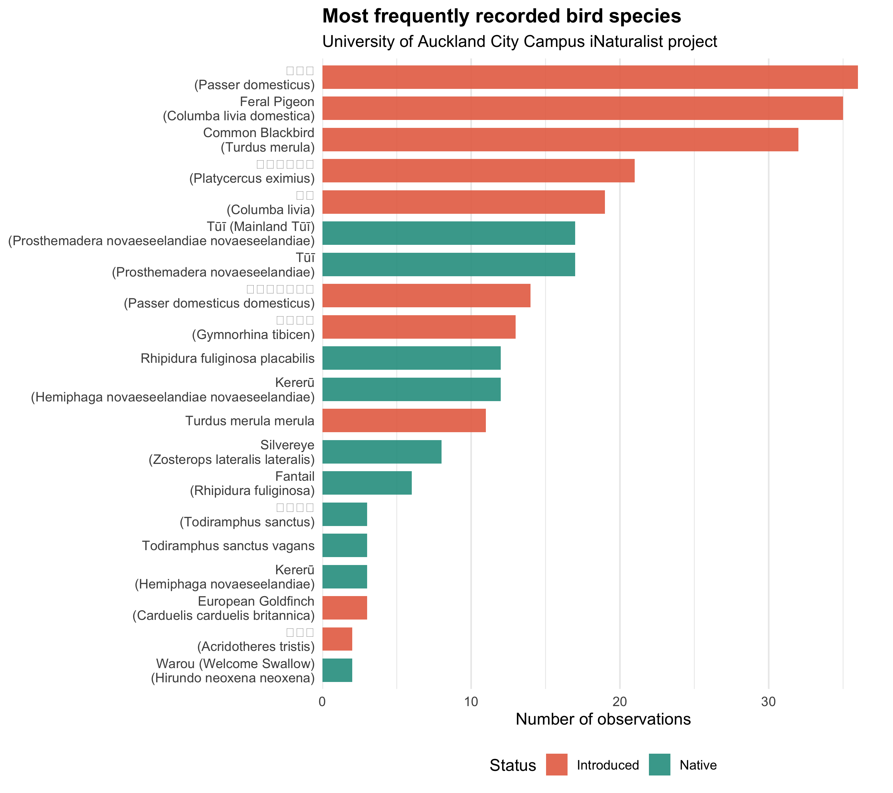
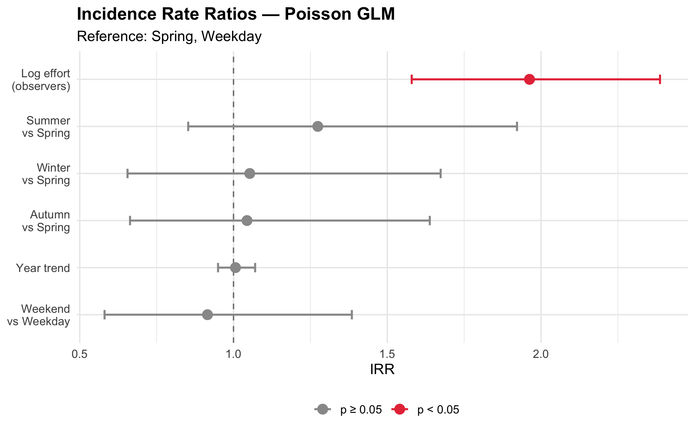

```{r setup, include=FALSE}
knitr::opts_chunk$set(echo = FALSE, warning = FALSE, message = FALSE,
                      fig.align = "center")
```

---

Walk across the University of Auckland's city campus on a Tuesday morning and you might spot a tūī working the kōwhai near the clock tower, its white throat feathers catching the light. Come back on a quiet Sunday and you might see nothing at all — not because the tūī has left, but because nobody was looking. This gap between what is *there* and what gets *recorded* sits at the heart of a decade-long dataset that volunteers have been building, one smartphone photograph at a time, since 2016.

The iNaturalist platform hosts a project dedicated to every living thing encountered on the University of Auckland's city campus. By April 2026, contributors had submitted 280 research-grade bird observations across 136 days, documenting 29 species over eleven years. Modest numbers, perhaps — but analysed carefully, this record reveals something both sobering and instructive about how we read nature in cities: the pattern of who is watching shapes what we see at least as powerfully as the birds themselves.

## Two worlds on one campus

The twenty most frequently recorded species divide cleanly into two ecological stories. House Sparrows lead the count at 36 observations, followed closely by Feral Pigeons (35), Common Blackbirds (32), and Australian Magpies (13) — the cosmopolitan urban commensals that have followed human settlement to every temperate city on the planet. Yet running alongside them, with strikingly similar observation totals, are birds of a different character entirely: tūī at 34 records, North Island Fantail or pīwakawaka at 18, kererū at 15, Silvereye or tauhou at 8, and the occasional Sacred Kingfisher perched above the campus fountain.

That tūī and kererū appear regularly on a campus hemmed in by concrete and traffic speaks to Auckland's network of urban parks and street plantings, particularly the mature trees of Albert Park immediately to the east. These are birds of mature native forest, and their persistence here is not incidental. It reflects decades of urban tree planting and, more recently, growing local interest in predator control.

But there is something worth pausing on in those observation totals. Tūī appear 34 times in the record; House Sparrows 36. House Sparrows vastly outnumber tūī on any urban campus — they are everywhere, unremarkable, background noise. Yet the two species sit almost level in the iNaturalist record. This is not an ecological fact. It is a social one. iNaturalist observers are selectively attentive: they notice and photograph the distinctive, the charismatic, the native. A House Sparrow requires a reason to be photographed; a tūī rarely does. The dataset does not simply reflect what is present. It reflects what people find worth recording, and those two things are not the same.

```{r figure1, fig.cap="**Figure 1.** Most frequently recorded bird species on the UoA city campus. Native NZ species shown in teal; introduced species in salmon. Note that tūī and House Sparrow sit at almost equal counts despite vastly different true abundances.", out.width="90%"}

```

## The observer effect, measured

To move beyond description, a Poisson generalised linear model was fitted to the 136 days of observation data, with daily species richness as the outcome. The predictors were: the number of observers active on that day (log-transformed as a proxy for effort), the season, whether the day fell on a weekend or weekday, and the year.

The result was unambiguous. Observer effort was by far the strongest predictor of how many species were recorded on any given day, with an Incidence Rate Ratio of 1.96 (95% CI: 1.58–2.39, p < 0.001). Each unit increase in log-observer count was associated with a near-doubling of expected species richness. Days when five or more people submitted observations produced an estimated 2.5 to 3 species on average; days with a single observer yielded roughly one to one and a half. The birds were presumably present either way.

Season, by contrast, showed no statistically significant effect, though the point estimates hint at modestly higher richness in summer compared to spring (IRR = 1.27, p = 0.24). Whether this reflects genuine seasonal variation — breeding-season vocalisations making birds more detectable, or post-fledging dispersal bringing juveniles into new areas — or simply that more students are on campus in summer cannot be resolved with this data alone. Weekend versus weekday made no detectable difference once effort was accounted for (IRR = 0.92, p = 0.69), and the year trend was essentially flat (IRR = 1.01 per year, p = 0.83).

The Poisson model was preferred over a negative binomial alternative based on AIC and an estimated dispersion parameter of θ ≈ 79,000, indicating no meaningful overdispersion. The slight underdispersion (residual deviance ratio of 0.23) is consistent with a dataset dominated by single-observer, single-species days — a very regular pattern that the Poisson model handles well.

```{r figure2, fig.cap="**Figure 2.** Incidence Rate Ratios from Poisson GLM with 95% confidence intervals. Observer effort (red) is the only statistically significant predictor. All other predictors — season, weekend, and year — have confidence intervals crossing the dashed line at IRR = 1, indicating no detectable effect.", out.width="80%"}

```

## What the numbers cannot tell us

It would be a mistake to read the dominance of the observer effect as deflating the ecological content of the record. The observer effect is not a refutation of the data; it is a lens correction. Once you account for how many people were looking, the seasonal and species-composition signals become interpretable rather than noise. The lesson is methodological: raw observation counts from opportunistic platforms cannot be compared across time periods without controlling for effort. A year in which iNaturalist gained popularity among students would show apparent growth in species richness even if every bird population on campus had declined.

This matters practically. If the goal is to track whether tūī are becoming more or less frequent on campus over time, or whether introduced species are expanding their range, raw counts will mislead. Effort standardisation — whether through structured transect surveys, acoustic monitoring, or at minimum statistical control for observer numbers — is not a refinement but a necessity.

The heatmap of monthly observation coverage across the eleven-year record makes the problem vivid. Early years (2016 to 2021) are sparse and patchy, with isolated months of activity. Coverage becomes substantially more consistent from 2024 onward, with the highest mean species richness appearing in April 2026 — coinciding, not coincidentally, with the period when this analysis was being prepared. Biodiversity datasets are not passive records of nature. They are products of human attention, shaped by who has time to look, what technology makes looking easy, and what questions someone decides to ask.

## What persists, and what that means

Despite these interpretive cautions, the species list itself carries genuine ecological signal. The regular appearance of tūī, kererū, pīwakawaka, and Sacred Kingfisher on a campus in the heart of one of Australasia's largest cities is meaningful. These are not marginal records or casual vagrants. They are species using the campus deliberately, exploiting the flowering trees, the fruiting canopy, and the insect life associated with gardens and old-growth plantings.

The native-to-introduced ratio in the dataset — roughly 31% native, 69% introduced across all observations — is worth holding alongside the recording-bias observation made earlier. Native species are probably over-represented in that 31% relative to their true numerical abundance, because observers are more likely to photograph them. The actual community on campus almost certainly leans more heavily toward introduced birds than the record suggests. This does not diminish the conservation value of the native species present; it simply means that claims about the campus "supporting" native biodiversity should be made carefully, with some acknowledgement of what the data can and cannot show.

Long-term continuation of the iNaturalist project, combined with periodic structured surveys to calibrate the effort-corrected trend, would substantially improve the inferential value of this record. The platform's great strength — continuity at essentially zero cost — comes with the obligation to analyse its outputs honestly.

The tūī in the kōwhai does not care whether it is a Tuesday or a Saturday, whether it is summer or winter, or whether the person walking past stops to take a photograph. But for those of us trying to understand how native wildlife persists in cities — and how to support it — noticing matters. So does knowing what kind of noticing we are actually doing.

---

## About the data and analysis

Observation data were exported from the iNaturalist project *Biota of University of Auckland City Campus* on 27 April 2026, filtered to research-grade Aves records. Analysis was conducted in R using a Poisson GLM with log-transformed observer count, season, day type, and year as predictors of daily species richness. Full code, annotated and reproducible, is available at: [https://github.com/mengyuanzheng9-star/uoa-campus-biota](https://github.com/mengyuanzheng9-star/uoa-campus-biota)

## Ethical considerations

All observations are publicly available through iNaturalist under Creative Commons licences. Observer usernames were used only as aggregate daily counts and were not linked to individual identities or behaviours. No precise coordinates of any observation are reproduced here. The analysis treats the iNaturalist record as a detectability-weighted sample, not a census of presence or abundance, and all interpretations are framed accordingly.

*AI use statement: Claude (Anthropic, claude-sonnet-4-6) was used to assist in generating the initial scaffold of the R Markdown analysis file, including code structure for the GLM, diagnostic plots, and table formatting. All analytical decisions — model structure, variable selection, and interpretation of results — were made independently by the author. All code was reviewed, tested, and run by the author. The text of this article was written independently, with AI assistance used only for a revised draft that the author then substantially edited and verified.*
